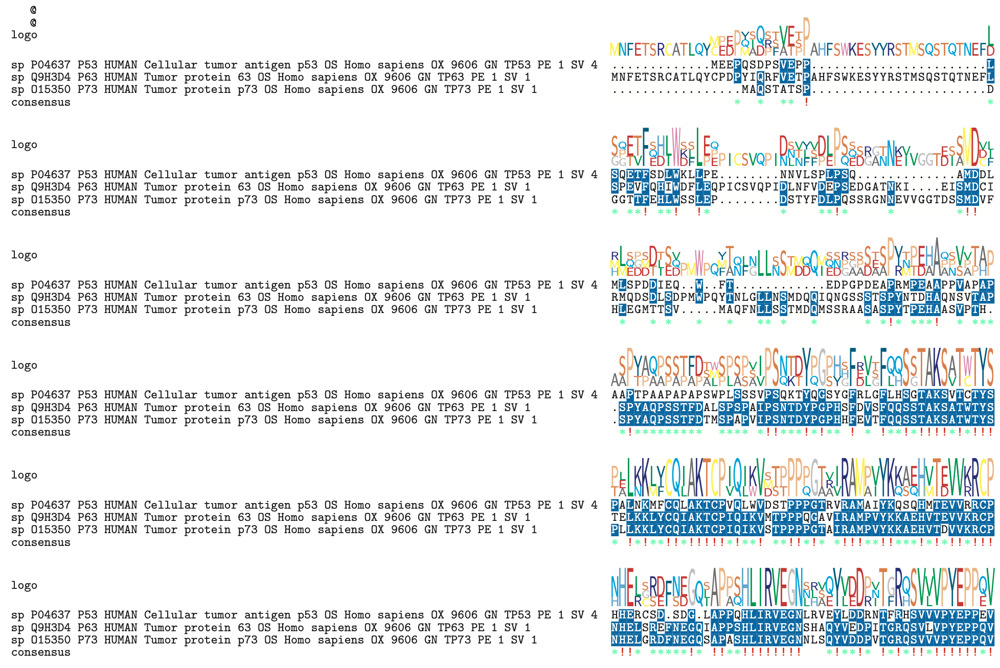
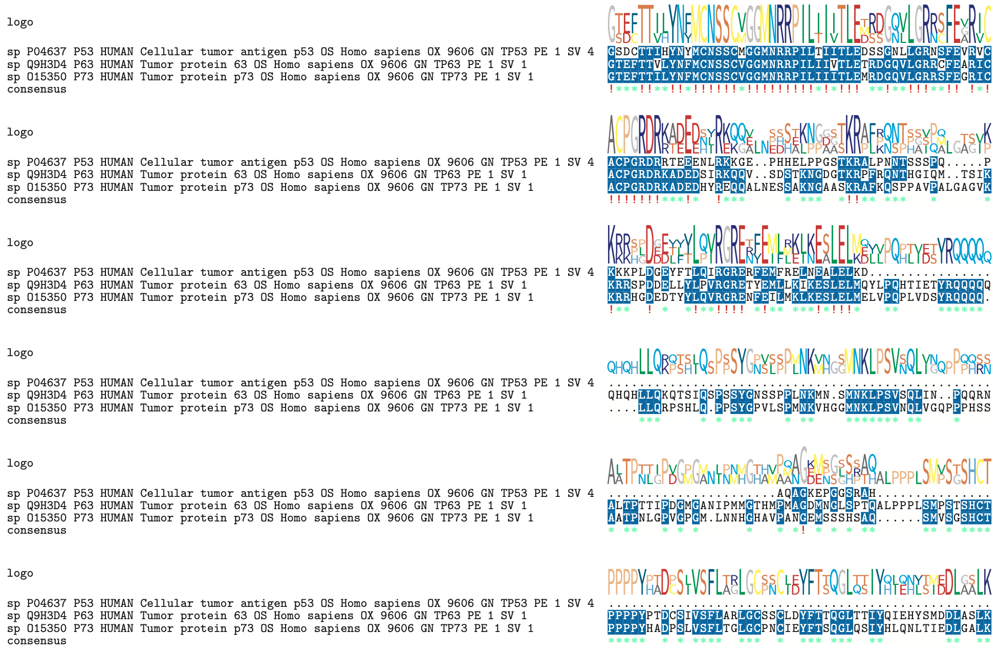
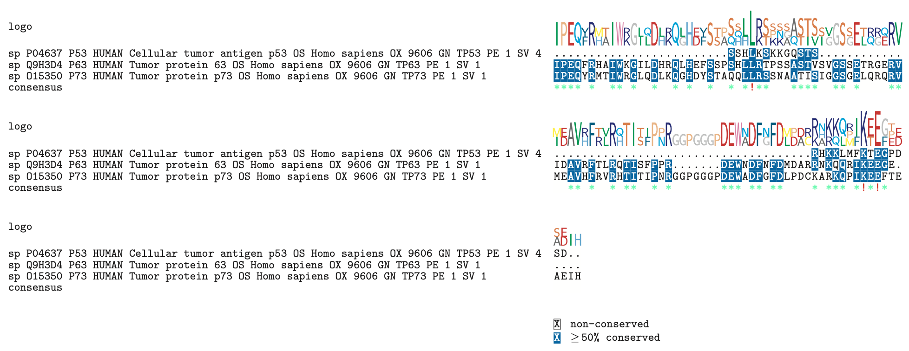

## Introduction (20 points)
### Scientific Question 
#### (5 points for specific, measurable, and clear scientific question)
Given that the p53 family of proteins (p53, p63, and p73) serve overlapping functions in normal development and regulating the expression of genes that control apoptosis in humans, how do they compare in terms of amino acid sequence identity and 3D protein structure?

### Background 
#### (5 points for background on the protein/gene/species of interest and where the data is sourced from)
The p53 gene is a tumor suppressor gene most frequently mutated in human cancers. The resulting p53 protein is a transcription factor that regulates the expression of genes that control apoptosis and cell cycle arrest in response to genotoxic and cellular stress. p63 and p73, two close homologs of p53, comprise the p53 family of proteins. Despite having the ability to transactivate p53 target genes and exert p53-like functions such as DNA-damage induced apoptosis and cell cycle arrest, p63 and p73 do not function as classical Knudson-type tumor suppressors and are rarely mutated in human cancers (DeYoung 2007). Furthermore, in addition to having redundant p53-like functions, p63 and p73 possess an extended C-terminal region containing a sterile alpha motif (SAM) known to regulate development which is not alternatively spliced in p53. This suggests that p63 and p73 play a separate additional role in the regulation of normal development (Levrero 2000). Interestingly, further research hints that the relationship between the p53 family of proteins is a lot more complex than we might think: some p63/p73 isoforms are p53-interfering-- they not only lack p53-like functions, but also act as dominant negatives against p53 activity (Yang 2002).

The intricate relationship between the p53 transcription factor family members and their overlapping but also opposing functions have been subject to extensive research and debate. Here we attempt to shed light to this question by investigating the amino acid sequence identity and structural homology of p53 family members.

### Scientific Hypothesis 
#### (5 points for clear, specific, and measurable scientific hypothesis that is in the form of an if-then statement) 
If the p53 family of proteins all serve the redundant function in normal development and regulating the expression of genes that control apoptosis in humans, then we would expect the amino acid sequence identity to be >50% and the DNA-binding domains to share structural homology.

### Analyses and Data 
#### (5 points for description of what analyses were done and how the data was downloaded for the project)
To compare and contrast the amino acid sequences of p53, p63, and p73, multiple sequence alignment with the MUSCLE algorithm was performed. This method will highlight differences in their sequence, including point mutations and indels. Between the three multiple sequence alignment algorithms in the msa package, the MUSCLE algorithm was used as it especially works well with proteins, and ClustalOmega is not suitable for alignment of sequences with large internal indels. The amino acid sequences of p53 (UniProt ID: P04637), p63 (Q9H3D4), and p73 (O15350) were downloaded in FASTA format from the UniProt database. To visualize the alignment, the msaPrettyPrint() function was used as it allows us to create a sequence logo, which displays a graphical representation of the sequence conservation of amino acids. It is a highly customizable multiple sequence alignment plot, assigning different colors for certain groups of amino acids to highlight differences between the sequences.

To compare the structural homology of p53 family members, homology modeling and structural bioinformatics were performed. Here, we focus only on the DNA-binding domain (DBD), as the p53 family members bind to very similar DNA motifs. The PDB files were obtained from RCSB PDB (Research Collaboratory for Structural Bioinformatics Protein Data Bank): p53 (Accession number: 2FEJ), p63 (2RMN), p73 (2XWC). The PDB files are then compared by alignment and superposition of the three structures using the pdbaln() function, calculating sequence identity using the seqidentity() function, and calculating the RMSD to measure structural similarity. The NGLVieweR() function was then used to visualize the 3D structures; this will show the folding and structure of the proteins, as well as looking at whether there are parts of the domain that is truncated/missing in one compared to the other. 

## Loading in Packages (15 points)
1. BiocManager: provides tools for installing and managing packages from Bioconductor.
2. BioStrings: memory efficient string containers, string matching algorithms, and other utilities, for fast manipulation of large biological sequences or sets of sequences. 
3. seqinr: used to retrieve and analyze biological sequences (DNA and protein) such as the read.fasta() function.
4. msa: provides a unified interface to the three multiple sequence alignment algorithms in this package: ‘ClustalW’, ‘ClustalOmega’, and ‘MUSCLE’.
5. muscle: performs multiple sequence alignments of nucleotide and amino acid sequences.
6. bio3d: provide utilities for the analysis of protein structure and sequence data.
7. NGLVieweR: used to visualize and interact with Protein Data Bank (PDB) and structural files in R.

```{r}
# Uncomment commands to install the necessary packages
# if (!require("BiocManager", quietly = TRUE))
    # install.packages("BiocManager")
# BiocManager::install()
library(BiocManager)
# BiocManager::install("Biostrings")
library(Biostrings)
# install.packages("seqinr")
library(seqinr)
# BiocManager::install("msa")
library(msa)
# BiocManager::install("muscle")
library(muscle)
# install.packages("bio3d", dependencies=TRUE)
library(bio3d)
# install.packages("NGLVieweR")
# install.packages("remotes")
# remotes::install_github("nvelden/NGLVieweR")
library(NGLVieweR)
```

## Performing Bioinformatics Analysis (20 points)
### Multiple Sequence Alignment with msaMuscle: this function calls the multiple sequence alignment algorithm MUSCLE on nucleotide or amino acid sequences. Multiple sequence alignment is a technique where three or more biological sequences are arranged next to one another to identify regions of similarity that may show functional, structural, and/or evolutionary relationships. This process involves maximal matching between the sequences according to a scoring-based algorithm. Below is code for a multiple sequence alignment on proteins p53, p63, and p73.
```{r}
# Amino acid sequences of p53, p63, and p73 proteins are downloaded from UniProtKB as fasta files, ensuring they are saved to the same directory as the R notebook

# Read fasta files using the function readAAStringSet from the Biostrings package and assign the appropriate fasta file to the variables "p53_seq", "p63_seq", and "p73_seq"
p53_seq <- readAAStringSet("p53.fasta")
p63_seq <- readAAStringSet("p63.fasta")
p73_seq <- readAAStringSet("p73.fasta")

# Print out each sequence to ensure the fasta file is read successfully
p53_seq
p63_seq
p73_seq

# Create a vector containing the 3 amino acid sequences and assign it to the variable "p53_family" in order to run the msa function on these 3 sequences in the same alignment
p53family <- c(p53_seq, p63_seq, p73_seq)

# Confirm the number of sequences in the vector
length(p53family)

# Run the msa function with MUSCLE algorithm on "p53family" and assign it to the variable "msa" for "multiple sequence alignment"
msa <- msaMuscle(p53family)

# Show the full length of the alignment
print(msa, show = "complete")
```

### Structural Bioinformatics using bio3d: pdb files of the DNA-binding domains of p53, p63, and p73 are first compared by alignment and superposition of the three structures. This creates multiple sequence alignments from a list of PDB files returning aligned sequence and structure records. Then, percent sequence identity scores for aligned sequences are calculated using seqidentity() function, which returns a numeric matrix with all pairwise identity values. The percent identity value is a single numeric score determined for each pair of aligned sequences. It measures the number of identical residues (“matches”) in relation to the length of the alignment. Finally, root mean square deviation (RMSD) is calculated to measure structural similarity of the DNA-binding domains of the three proteins.

```{r}
# Read pdb files of the DNA binding domains of p53 (2FEJ), p63 (2RMN), and p73 (2XWC) using the read.pdb() function from the bio3d package by providing the file paths (or PDB accession numbers) and assign them to the variables "p53_pdb", "p63_pdb", and "p73_pdb)
p53_pdb <- read.pdb("2fej.pdb")
p63_pdb <- read.pdb("2rmn.pdb")
p73_pdb <- read.pdb("2xwc.pdb")

# Create a multiple sequence alignment of the PDB files using the pdbaln() function and assign it to the variable "pdbs"
pdbs <- pdbaln(c("2fej.pdb", "2rmn.pdb", "2xwc.pdb"), fit=TRUE, web.args = list(email = "akristin@ucsd.edu"))

# Print "pdbs" to view the alignment
pdbs

# Calculate percent sequence identity and assign the resulting matrix array to the variable "seqid"
seqid <- seqidentity(pdbs)

# Rename column and row names for easy interpretation
colnames(seqid) <- c("p53", "p63", "p73")
rownames(seqid) <- c("p53", "p63", "p73")

# Print renamed matrix
seqid

# Create a function to interpret sequence identity values that returns "homolog" if value is > 0.5 or 50% and returns "non-homolog" if value is =< 0.5
interpret <- function(seqid){
  if (seqid > 0.5) {
    print ("homolog")
    return(seqid)
  } else {
    print ("non-homolog")
    return (seqid)
  }
}

# Create variables for each pairing of the 3 proteins
p53andp63 <- seqid[2,1]
p53andp73 <- seqid[3,1]
p63andp73 <- seqid[2,3]

# Use the created function to interpret sequence identity values
interpret(p53andp63)
interpret(p53andp73)
interpret(p63andp73)

# Calculate RMSD to measure structural similarity
rmsd <- rmsd(pdbs, fit = TRUE)

# Rename column and row names for easy interpretation
colnames(rmsd) <- c("p53", "p63", "p73")
rownames(rmsd) <- c("p53", "p63", "p73")

# Print renamed matrix
rmsd
```

## Plotting the Results (15 points)
### msaPrettyPrint: msaPrettyPrint is a function that allows graphical representation of the multiple sequence alignment that shows the sequence conservation of amino acids in a sequence logo. The left hand side shows the ID and name of the 3 proteins (p53, p63, and p73) and the consensus sequence based on this alignment. The colorful stack of letters at each position on top of the sequence alignment is the sequence logo, where the relative sizes of the letters indicate their frequency in the sequences. 

```{r}
# Use msaPrettyPrint to generate the sequence logos. The output is a .tex and a pdf file
msaPrettyPrint(msa, output = "tex", showNames = "left", showLogo = "top", logoColors = "rasmol", shadingMode = "functional", shadingModeArg = "structure", showLegend = FALSE, askForOverwrite = FALSE)

# One of the output files is a pdf file, which was screenshot and knitted as png's



```

### NGLVieweR: NGLVieweR is used to visualize the 3D structure of the pdb files. Below is the code to visualize the structure of the DNA-binding domains of proteins p53, p63, and p73, using their PDB accession codes 2FEJ, 2RMN, and 2XWC respectively.
```{r}
## Source:: https://github.com/nvelden/NGLVieweR#:~:text=NGLvieweR%20provides%20an%20R%20interface,in%20R%20and%20Shiny%20applications.
## Source: https://cran.r-project.org/web/packages/NGLVieweR/vignettes/NGLVieweR.html

# View structure of the DNA-binding domain of p53
NGLVieweR("2FEJ") %>%
addRepresentation("cartoon")

# View structure of the DNA-binding domain of p63
NGLVieweR("2RMN") %>%
addRepresentation("cartoon")

# View structure of the DNA-binding domain of p73
NGLVieweR("2XWC") %>%
addRepresentation("cartoon")
```

## Analyzing the Results (15 points)
Multiple sequence alignment on p53, p63, and p73 protein sequences were performed using the msa function with the MUSCLE algorithm. A dash in one sequence (-) indicates a deletion in that residue position, or a missing/truncated sequence compared to the other sequences aligned. As shown in the alignment, p63 and p73 are more similar in length (680 and 636 amino acid residues) compared to p53 (only 393 residues). It can be observed in the alignment that p53 has a shorter/truncated C-terminal region compared to p63 and p73, as p53 shows mostly dashes towards the end of the alignment (approximately positions 434-704). This supports the previous findings that an extended C-terminal region containing a sterile alpha motif (SAM) known to regulate development is alternatively spliced in p63 and p73 but not in p53, which suggests that p63 and p73 play an additional separate role in regulating normal development (Levrero 2000). Despite so, the majority of the DNA-binding domain residues (usually defined as residues 94-292 in p53) are conserved across the 3 proteins as evident from the sequence logo. 

Following this observation, the DNA-binding domains of p53, p63, and p73 are analyzed by performing a  multiple sequence alignment on the pdb files of the DNA-binding domain structures of the 3 proteins. As shown in the alignment, there are less dashes observed, meaning there aren't many indels in the DBD, residues in the DBD of the 3 proteins are mostly conserved. Using the resulting pdb alignment, their sequence identity is calculated using the seqidentity() function, which returns a matrix of sequence identity values between the 3 proteins. Using the created interpret() function, it can be observed that all 3 proteins are "homologs" to each other as their sequence identity is greater than 50%. The sequence identity between p53 and p63 is 55.4%; p53 and p73 is 56.7%; p63 and p73 is 82.4%. Consistent with our previous observations from the aligments performed, p63 and p73 are more similar to each other than to p53. The sequence identity between p53 and p63 compared to p53 and p73 is almost the same, with p73 being slightly more similar to p53. Finally, root-mean-square deviation values is calculated using the rmsd() function. The rmsd value gives the average deviation between the corresponding atoms of two proteins: the smaller the rmsd, the more similar the two structures; the rmsd would be 0 between identical structures. The rmsd values matrix shows that the value between p53 and p63 is 4.980; p53 and p73 is 2.979; p63 and p73 is 4.004. Generally, a value of < 2 is considered structurally very similar. Based on these values, p53 and p73 is most structurally similar, followed by p63 and p73, and finally p53 and p63 although they are all above 2. Meaning, despite their high sequence identities, the 3 proteins are structurally distinct in their DBD. This is evident by visualization of the structures using NGLVieweR as well; while all the 3 structures seem distinct, p53 and p73 look the most similar as they are spherical in shape, while p63 looks like it has two "domains" with a bridge connecting the two. 

Based on these analyses, my hypothesis was partially correct, as the sequence identities between the 3 proteins are >50%. However, it is still and unclear whether the p53 family of proteins serve the same or distinct functions; consistent with what we know today, the p53 family has some overlapping functions but also distinct ones, which can be explained by their seemingly similar sequence identities, especially in the DNA-binding domain, but not so similar in structure. 